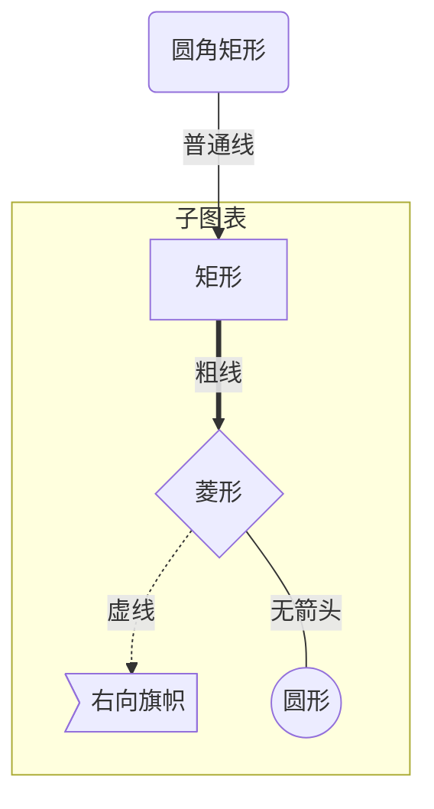

# 一、标题
在想要设置为标题的文字前面加#来表示

一个#是一级标题，二个#是二级标题，以此类推。支持六级标题。

注：标准语法一般在#后跟个空格再写文字，貌似简书不加空格也行。

```text
# 这是一级标题
## 这是二级标题
### 这是三级标题
#### 这是四级标题
##### 这是五级标题
###### 这是六级标题
```
运行效果：

# 这是一级标题
## 这是二级标题
### 这是三级标题
#### 这是四级标题
##### 这是五级标题
###### 这是六级标题

# 二、字体

* 加粗 

        要加粗的文字左右分别用两个*号包起来

* 斜体 

        要倾斜的文字左右分别用一个*号包起来
* 斜体加粗 

        要倾斜和加粗的文字左右分别用三个*号包起来
* 删除线 

        要加删除线的文字左右分别用两个~~号包起来
 
运行效果：

**这是加粗的文字**

*这是倾斜的文字*

***这是斜体加粗的文字***

~~这是加删除线的文字~~

# 三、引用

在引用的文字前加>即可。引用也可以嵌套，如加两个>>三个>>>

>这是引用的内容
>>这是引用的内容
>>>>>>>>>>这是引用的内容

# 四、分割线

三个或者三个以上的 - 或者 * 都可以。

---
----
***
*****

# 五、图片

语法：
```text

```

- 图片alt就是显示在图片下面的文字，相当于对图片内容的解释。
- 图片title是图片的标题，当鼠标移到图片上时显示的内容。title可加可不加
```text

```


# 六、超链接

语法：
```text
[超链接名](超链接地址 "超链接title")
title可加可不加

实例：
[简书](http://jianshu.com)
[百度](http://baidu.com)

```
[简书](http://jianshu.com)

[百度](http://baidu.com)

```
注：markdown本身语法不支持链接在新页面中打开，貌似简书做了处理，是可以的。别的平台可能就不行了，如果想要在新页面中打开的话可以用html语言的a标签代替。
<a href="超链接地址" target="_blank">超链接名</a>

例<a href="https://www.jianshu.com/u/1f5ac0cf6a8b" target="_blank">简书</a>
```

<a href="https://www.jianshu.com/" target="_blank">简书</a>

# 七、列表

* 无序列表  
```text无序列表用 - + * 任何一种都可以```

* 有序列表(数字加点)
   
1. 列表内容
2. 列表内容

*   列表嵌套(上一级和下一级之间敲三个空格即可)
   * 一级无序列表内容
      * 二级无序列表内容
      * 二级无序列表内容
   * 一级无序列表内容
      * 二级无序列表内容
      * 二级无序列表内容

# 八、表格

```text
表头|表头|表头
---|:--:|---:
内容|内容|内容
内容|内容|内容

注：原生的语法两边都要用 | 包起来。此处省略
1）|、-、:之间的多余空格会被忽略，不影响布局。
2）默认标题栏居中对齐，内容居左对齐。
3）-:表示内容和标题栏居右对齐，:-表示内容和标题栏居左对齐，:-:表示内容和标题栏居中对齐。
4）内容和|之间的多余空格会被忽略，每行第一个|和最后一个|可以省略，-的数量至少有一个。

```

 |一个普通标题|一个普通标题|一个普通标题 |
| ------ | ------: |:----: |
| 短文本 | 中等文本 | 稍微长一点的文本 |
| 稍微长一点的文本 | 短文本 | 中等文本 |


# 九、代码

单行代码：代码之间分别用一个反引号包起来

`create database hero;`

代码块

```
function fun(){
     echo "这是一句非常牛逼的代码";
}
fun();
```

# 十、流程图

```flow
st=>start: 开始框
op=>operation: 处理框
cond=>condition: 判断框(是或否?)
sub1=>subroutine: 子流程
io=>inputoutput: 输入输出框
e=>end: 结束框
st(right)->op(right)->cond
cond(yes)->io(bottom)->e
cond(no)->sub1(right)->op
```

```flow
st=>start: 开始框
op=>operation: 处理框
cond=>condition: 判断框(是或否?)
sub1=>subroutine: 子流程
io=>inputoutput: 输入输出框
e=>end: 结束框
st->op->cond
cond(yes)->io->e
cond(no)->sub1(right)->op
```




###markdown编辑器Typora（支持mermaid流程图）

